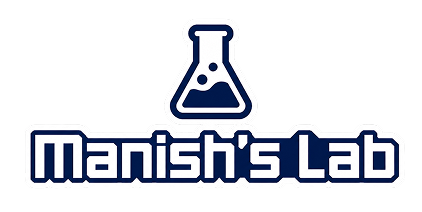

  

## Hi, I'm Manish 👋

I'm a **product designer** working across **AI systems, FinTech, enterprise UX, and human-centered product design**.

I've spent most of my career designing applications for major financial institutions: systems where people make high-stakes decisions and need clarity, trust, control, and accountability built into the product itself.

My current focus is **agentic infrastructure UX**: permission models, approval flows, audit trails, autonomy controls, escalation paths, operator dashboards, and governance interfaces for systems that can act on their own.

The featured work below moves through the full stack of agentic UX:

**one agent under human supervision → a fleet of agents under organizational governance → a team of agents running live work.**

---

### ⭐ Featured · Agentic infrastructure UX

Self-initiated product concepts designed as ready-to-build blueprints. Each one is clickable end to end and focuses on the UX layer that makes autonomous systems understandable, controllable, and safe to operate.

<table>
<tr>
<td width="52%">

</td>
<td width="48%">

#### 🦅 [Kestrel](https://tmanish.github.io/kestrel/)
**One human supervising one agent that moves real money.**

Kestrel is an oversight interface for an autonomous accounts-payable agent. A financial controller can inspect authority, review evidence, approve exceptions, retract autonomy, and understand exactly why the agent is asking for human attention.

You cannot audit a chat window. Kestrel designs the verification layer instead: authority as a readable contract, autonomy as a retractable dial, and exception handling built for real financial operations.

[Prototype](https://tmanish.github.io/kestrel/docs/) · [Case study](https://tmanish.github.io/kestrel/CASE-STUDY.html)

</td>
</tr>

<tr>
<td width="52%">

</td>
<td width="48%">

#### 🦉 [Falcon](https://tmanish.github.io/falcon/)
**One organization governing a fleet of agents.**

Falcon is a governance control plane for agents running across finance, legal, support, and operations. It turns agent activity into something leaders can inspect, constrain, and tune without needing to read logs or trust black-box automation.

It includes working approval queues, audit trails, live state, blast-radius diffs before irreversible actions, plain-language scope contracts, and guardrails that can be tested in Monitor mode before switching to Block.

[Prototype](https://tmanish.github.io/falcon/Falcon_Agent_Governance.html) · [Case study](https://tmanish.github.io/falcon/CASE-STUDY.html)

</td>
</tr>

<tr>
<td width="52%">

</td>
<td width="48%">

#### 🪶 [Osprey](https://tmanish.github.io/osprey/)
**Building and running teams of agents.**

Osprey is an orchestration platform designed operator-first, not engine-first. You assemble a team of agents, define how work moves between them, and monitor execution as it happens.

The interface uses agent lanes, live status, plain-language logs, and dense operational state to make multi-agent work legible. It is also a stress test for my own design system under live, high-density, agentic conditions.

[Prototype](https://tmanish.github.io/osprey/Osprey.html)

</td>
</tr>
</table>

---

### 🚀 Shipped product

- 📈 **[Raven Tracker](https://raventracker.app)**: a live, in-production asset-tracking product for BTC, Gold, Silver, QQQ, and SPY, powered by custom AI/ML algorithms.

---

### 🧰 Builds, tools, and experiments

Public work across product design, AI tooling, interaction models, and software builds.

**Products & tools**
- 🧩 **[Raven Suite](https://github.com/tmanish/raven-suite)**: six single-file browser apps that work as a lightweight Office and Figma alternative: word processor, PDF editor, spreadsheet, slides, email builder, and vector design tool. Client-side only, nothing leaves your device.
- 🧩 **[Raven Scope](https://github.com/tmanish/raven-scope)**: turns the WiFi you already have into live motion, presence, and through-wall radar. Zero extra hardware, zero dependencies beyond Python's standard library.
- 🧩 **[Merlin Touchless Interface](https://github.com/tmanish/merlin-touchless-interface)**: control a screen with your eyes and a pinch. No mouse, no touch, no special hardware beyond a webcam.

#### 🛠️ Claude Skills

Reusable Claude skills built from real workflows. This is where I am exploring how prompts become repeatable, inspectable, tool-like systems.

- 🧩 **[prompt-to-loop](https://github.com/tmanish/prompt-to-loop)**: converts any build prompt into a structured agentic loop with elicitation, verification, and stop conditions. Explainer primer: [Loop Engineering Lab](https://tmanish.github.io/prompt-to-loop/).

Full set pinned below and on the **Repositories** tab 👇
